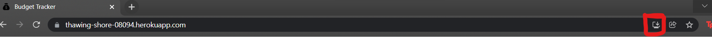

# PWA Budget Tracker

 
  

## Table of Contents
* [Description](#description)
* [User Story](#user-story)
* [Acceptance Criteria](#acceptance-criteria)
* [Deployment](#deployment)
* [Installation](#installation)
* [Usage](#usage)
* [Credits](#credits)
* [Project Insight](#project-insight)
* [Questions](#questions)
* [License](#license)

## Description
This project was designed as a homework assignment for Rutgers Coding Boot Camp. We were challenged to update an existing budget tracker application to allow for offline access and functionality. Users should be able to add expenses and deposits to their budget with or without a connection. If the user enters transactions offline, the total should be updated when they're brought back online.

Starter code was provided.

## User Story 
    AS AN avid traveler
    I WANT to be able to track my withdrawals and deposits with or without a data/internet connection
    SO THAT my account balance is accurate when I am traveling 

## Acceptance Criteria 
    GIVEN a budget tracker without an internet connection
    WHEN the user inputs an expense or deposit
    THEN they will receive a notification that they have added an expense or deposit
    WHEN the user reestablishes an internet connection
    THEN the deposits or expenses added while they were offline are added to their transaction history and their totals are updated

## Deployment
Launch the application by clicking [HERE](https://thawing-shore-08094.herokuapp.com/)

## Installation
You can also install this application to your desktop. Visit the website, then click the "Install" pop-up that appears in the address bar (Refer to the image below).   

## Usage

## Credits
[Express.js](https://expressjs.com/)

[MonogDB](https://www.mongodb.com/)

[Mongoose](https://mongoosejs.com/)

## Project Insight

## Questions
If you have any questions about this project contact me directly at warrenp11@gmail.com. 
  
Visit this project's repository at https://github.com/warrenp11/pwa-budget-tracker

View more of my projects at https://www.github.com/warrenp11

## License
Licensed under the [MIT](./LICENSE.txt) license.